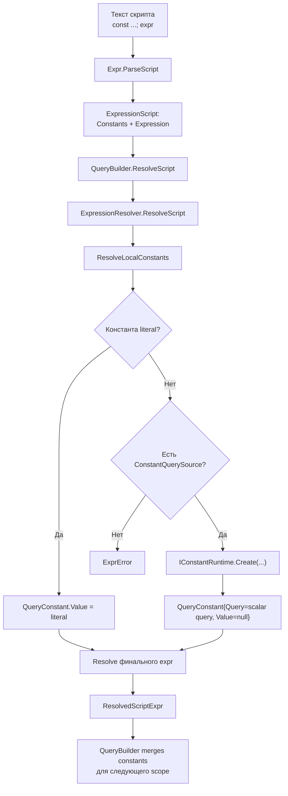
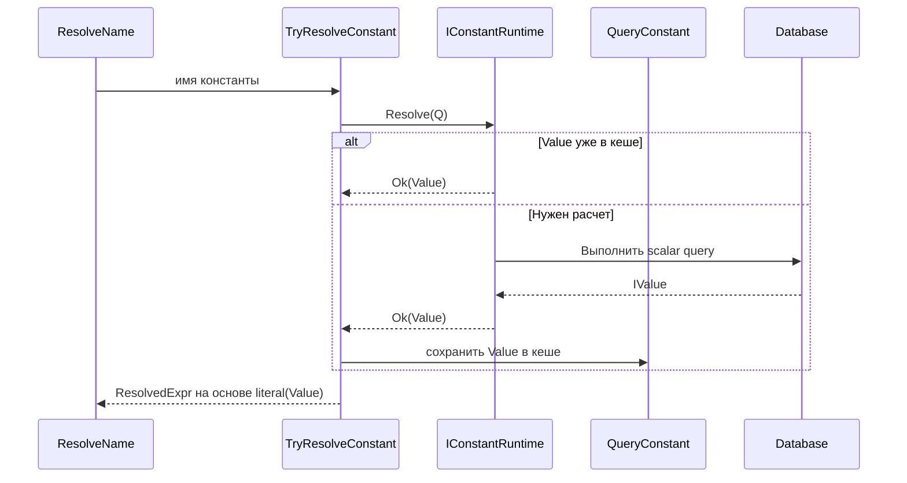

# Constant Runtime Flow

Документ описывает, как скриптовые `const` проходят через:

- `QueryBuilder`
- `ExpressionResolver`
- `IConstantRuntime` (`DisabledConstantRuntime` / `RunnerConstantRuntime`)
- исполнение SQL

## 1. Общий поток

## 2. Кто за что отвечает

- `QueryBuilder`:
  - передает `QuerySource` и `ConstantQuerySource`;
  - хранит глобальные константы запроса;
  - после `Where` сохраняет константы из скрипта в общий scope.
- `ExpressionResolver`:
  - валидирует объявления;
  - строит локальный scope;
  - решает, когда взять значение сразу, а когда использовать runtime.
- `IConstantRuntime`:
  - `Create`: как представить вычисляемую константу (обычно scalar query);
  - `Resolve`: как получить значение (кеш или вычисление).

## 3. Вычисление константы при обращении

## 4. Реализации runtime

- `DisabledConstantRuntime`:
  - `Create`: формирует scalar `QueryConstant`;
  - `Resolve`: возвращает ошибку, если `Value` еще не вычислено.
- `RunnerConstantRuntime`:
  - `Create`: формирует scalar `QueryConstant`;
  - `Resolve`: при пустом кеше выполняет query через `IQueryExecutor`, потом кеширует `Value`.

## 5. Важные правила

- Локальная константа может ссылаться только на ранее объявленные константы.
- Константа должна быть либо literal/constant-expression, либо агрегатным выражением.
- Без `ConstantQuerySource` сложную константу создать нельзя.
- Без активного runtime сложная константа не вычисляется.
- Кеш константы живет в рамках жизненного цикла текущего `QueryBuilder`/запроса.

