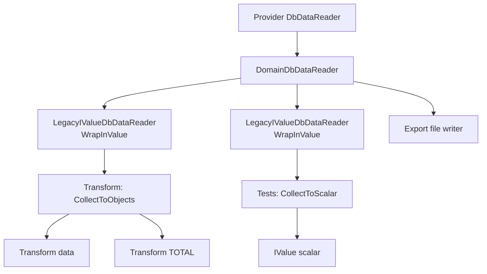

# DbDataReader Decorators Flow

## Purpose

This note documents how `DbDataReader` decorators are composed and where data goes in:

- `api/transform`
- dataset export
- scalar collection in tests

It also fixes one important behavioral rule:

- `DbDataReaderDecorator` must forward async APIs (`ReadAsync`, `NextResultAsync`) to the inner provider reader to keep true async I/O and cancellation support.

## Decorators

- `DbDataReaderDecorator` is the base wrapper.
- `DomainDbDataReader` is the runner output contract (`IQueryExecutor.GetDataReaderAsync`).
  It composes CLR normalization + alias mapping and exposes domain metadata via `GetDomainType(...)`.
- `LegacyIValueDbDataReader` (`WrapInValue`) maps CLR values to `IValue` for current legacy contracts.
- `FieldAliasDbDataReader` is used inside `DomainDbDataReader` composition.

## Runtime Flow (Mermaid, simplified)

## Notes About TOTAL and Scalar

- In current `TransformEndpoint`, `TOTAL` is fetched from the first row of `CollectToObjects(...)` result via `data[0].Int("TOTAL")`.
- `CollectToScalar(...)` is currently used in expression tests (`ExprTests.GetScalarAsync`) and other scalar scenarios, but not in `TransformEndpoint`.
