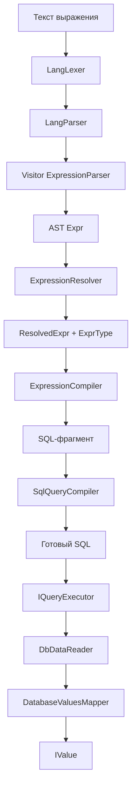

# Конвейер выражений (парсинг -> разрешение -> выполнение)

Этот документ описывает жизненный цикл выражения от текста до
скомпилированного SQL-фрагмента и исполнения. Также перечислены ключевые
классы и порядок их ответственности.

## Высокоуровневый поток

## Ответственности и порядок

### 1) Парсинг и AST

- `Expr.Parse` (`src/ReData.Query.Lang/Expressions/Expr.cs`)
  - Точка входа в парсинг.
  - Использует ANTLR `LangLexer` и `LangParser`.
  - Кэширует выражения в `Global.MemoryCache` со скользящим TTL.
  - Возвращает `Result<Expr, ExprError>`.
- `LangLexer.g4` / `LangParser.g4`
  - Определяют токены, приоритеты, грамматику.
- `ExpressionParser` (`src/ReData.Query.Lang/ExpressionParser.cs`)
  - Visitor, строящий AST (`Expr`).
  - Преобразует операторы в `FuncExpr`.
  - Разворачивает интерполяцию строк в `Text(...)` и цепочки `+`.
- Узлы AST (`src/ReData.Query.Lang/Expressions`)
  - `Expr` базовый класс со `Span` и `Equivalent`.
  - Литералы: `StringLiteral`, `IntegerLiteral`, `NumberLiteral`,
    `BooleanLiteral`, `NullLiteral`.
  - `NameExpr` для имен.
  - `FuncExpr` для операторов, функций и методов.

### 2) Разрешение (типы + шаблоны)

- `ExpressionResolver` (`src/ReData.Query.Core/ExpressionResolver.cs`)
  - Превращает `Expr` в `ResolvedExpr` или ошибки.
  - Использует `ResolutionContext`:
    - `IQuerySource` для поиска полей.
    - `IFunctionStorage` для выбора перегрузки.
    - `ILiteralResolver` для литералов.
    - `Constants` для подстановки значений.
  - Шаги разрешения:
    1. `Literal` -> `ILiteralResolver.Resolve` (шаблон + тип).
    2. `NameExpr` -> поиск в `IQuerySource.Fields()`.
    3. `FuncExpr` -> разрешение аргументов, затем сигнатуры функции.
- `IFunctionStorage` (`src/ReData.Query.Core/Components/IFunctionStorage.cs`)
  - Принимает `FunctionSignature`, возвращает `FunctionResolution`.
- `FunctionStorage` (`src/ReData.Query.Core/Components/Implementation/FunctionStorage.cs`)
  - Подбирает перегрузку по имени, виду и типам аргументов.
  - Вставляет неявные преобразования типов.
  - Валидирует агрегацию (нельзя смешивать агрегированные и неагрегированные
    аргументы, нельзя вкладывать агрегацию).
  - Вычисляет правила для константности/агрегации/nullable.
- `ILiteralResolver` (`src/ReData.Query.Core/Components/ILiteralResolver.cs`)
  - Реализации для каждой БД: `src/ReData.Query/LiteralResolvers/*`.
  - Преобразует литералы в `ResolvedExpr` с `ITemplate`.
- `ResolvedExpr` (`src/ReData.Query.Core/Template/ResolvedExpr.cs`)
  - Хранит `Expr`, `ExprType`, `ITemplate` и аргументы.

### 3) Компиляция шаблонов

- `ITemplate` / `IToken` (`src/ReData.Query.Core/Template/*`)
  - Шаблон — список токенов:
    - `ConstToken` для текста SQL.
    - `ArgToken` для вставки аргумента.
- `ExpressionCompiler` (`src/ReData.Query.Core/Components/Implementation/ExpressionCompiler.cs`)
  - Рекурсивно подставляет `ArgToken`.
  - Формирует SQL-фрагмент в `StringBuilder`.

### 4) Компиляция запроса и выполнение

- `QueryBuilder` (`src/ReData.Query.Core/QueryBuilder.cs`)
  - Использует `ExpressionResolver`, превращая текст в `ResolvedExpr`.
  - Применяет ограничения уровня запроса (например, `WHERE` должен быть boolean
    и не агрегирован; правила `GROUP BY`).
- `SqlQueryCompiler` (`src/ReData.Query/QueryCompilers/SqlQueryCompiler.cs`)
  - Вставляет выражения в SQL-клаузы.
  - Вызывает `ExpressionCompiler.Compile` для каждого `ResolvedExpr`.
- `IQueryExecutor` (`src/ReData.Query/Runners/IQueryExecutor.cs`)
  - Выполняет SQL против подключения БД.
- `DatabaseValuesMapper` (`src/ReData.Query/Runners/DatabaseValuesMapper.cs`)
  - Преобразует значения БД в `IValue`.

## Константы в скрипте

Обработка констант выполняется на этапе `ExpressionResolver.ResolveScript`:

1. Парсер возвращает `ExpressionScript` (`constDecl* + финальное expr`).
2. `ResolveLocalConstants` проходит объявления сверху вниз.
3. Для каждого `const`:
   - проверяется отсутствие дубликата в локальном/глобальном scope;
   - выражение константы резолвится;
   - допускаются только `const` или `aggregated` выражения;
   - если это прямой литерал, значение кладется сразу в `QueryConstant.Value`;
   - иначе используется `IConstantRuntime.Create(...)`.
4. Финальное выражение скрипта резолвится в объединенном scope.

При использовании имени константы:

- `ResolveName` сначала вызывает `TryResolveConstant`;
- `IConstantRuntime.Resolve(...)` возвращает значение (из кеша или через вычисление);
- значение переводится в ReData-литерал (`ToReDataLiteral`), затем снова парсится и резолвится;
- если константа не найдена, выполняется fallback на поле (`TryResolveField`).

### `const(...)` (inline-константа)

- `const(expr)` вычисляет `expr` как временную константу только для текущего выражения.
- `const(...)` парсится как обычный вызов функции, но обрабатывается отдельно в `ExpressionResolver` и не требует регистрации в `FunctionStorage`.
- Для выражений, не являющихся прямым литералом, используется `IConstantRuntime` (и для константных, и для агрегатных случаев), после чего `const(...)` подставляется как literal (`IsLiteral = true`).
- Вычисление делается в том же query-scope, где были разрешены поля аргумента.
- Результат `const` не сохраняется в `QueryBuilder.Constants` и недоступен в следующих блоках (`Where`/`Select`/`OrderBy`).

## Библиотека функций и различия БД

- Определения функций находятся в `src/ReData.Query/Functions` и
  регистрируются через `GlobalFunctionsStorage`.
- Форматирование литералов и экранирование идентификаторов зависят от БД и
  реализованы в `src/ReData.Query/LiteralResolvers`.
- `Factory` (`src/ReData.Query/Factory.cs`) связывает resolver, function storage,
  компилятор и runner для каждой БД.
