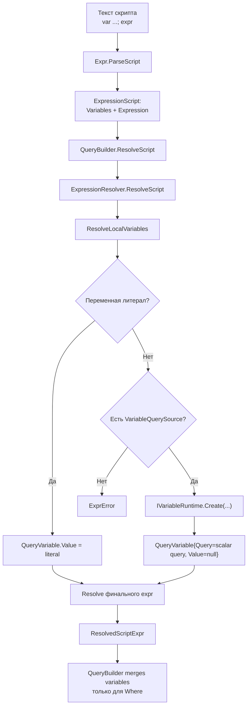
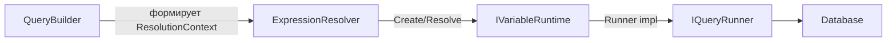
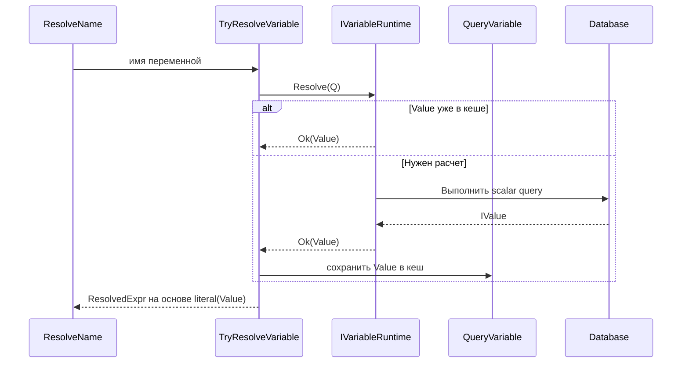
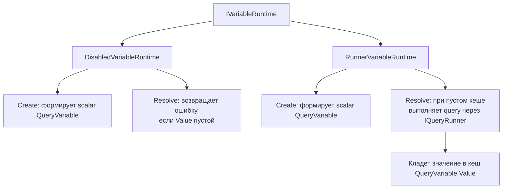

# VariableRuntime: цепочка взаимодействия

Документ описывает, как новая модель переменных проходит через:

- `QueryBuilder`
- `ExpressionResolver`
- `IVariableRuntime` (`DisabledVariableRuntime` / `RunnerVariableRuntime`)
- исполнение SQL

## 1. Общий поток

## 2. Кто за что отвечает

- `QueryBuilder`:
  - передает `QuerySource` и `VariableQuerySource`;
  - хранит глобальные переменные запроса;
  - после `Where` сохраняет переменные из скрипта в общий scope.
- `ExpressionResolver`:
  - валидирует объявления;
  - строит локальный scope;
  - решает, когда переменную можно взять сразу как `Value`, а когда нужен runtime.
- `IVariableRuntime`:
  - `Create`: как представить вычисляемую переменную (обычно scalar query);
  - `Resolve`: как получить значение (кеш или вычисление).

## 3. Вычисление переменной при обращении

## 4. Какие runtime бывают

## 5. Важные правила

- Локальная переменная может ссылаться только на ранее объявленные переменные.
- Переменная должна быть:
  - либо литералом/константным выражением;
  - либо агрегацией.
- Без `VariableQuerySource` сложную переменную создать нельзя.
- Без активного runtime сложная переменная не вычисляется.
- Кеш переменной живет в рамках жизненного цикла текущего `QueryBuilder`/запроса.
